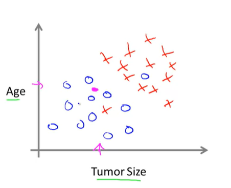
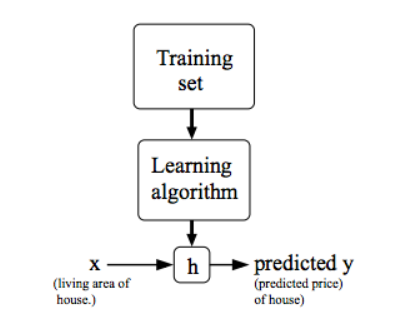
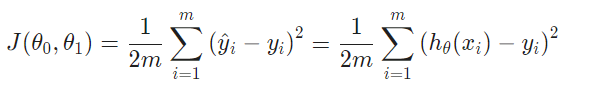
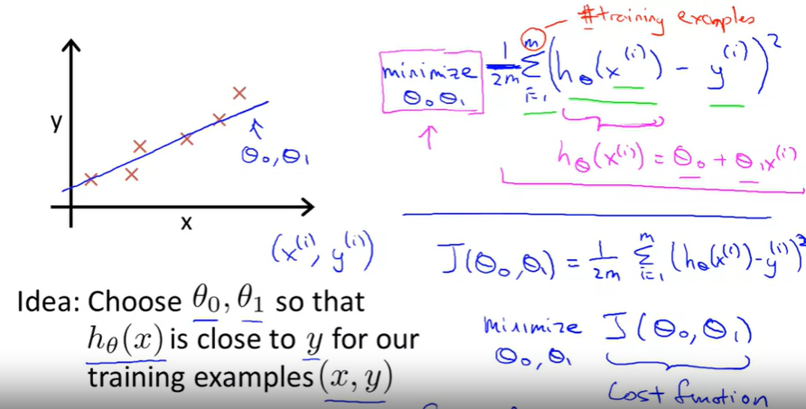
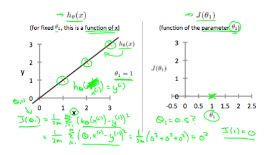
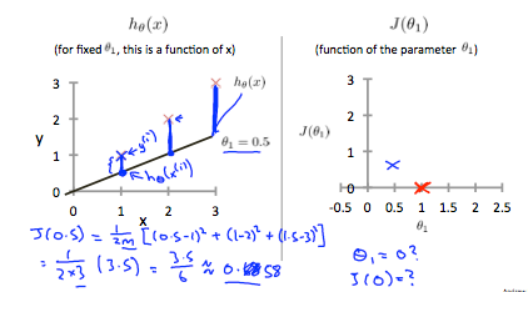
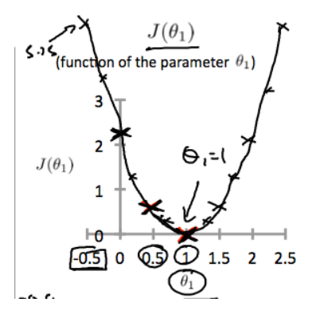
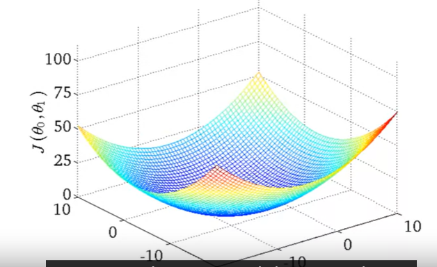

# 1. Supervised Learning

- `right answer` is given

## Regression
- predict "continuous" valued output(price)


- e.g) housing prices
## "classification problem" 
- discrete valued ouput( 0 or 1)
- value output - cancer type 1, 2 ,3 is also classification problem

- e.g)
  - breast cancer (malignant, benign)
  
- age / tumor size
  - clump thickness
  - unifomrity of cell size
  - uniformity of cell shape
- support vector machine
  - allow computer compute infinte features
- summary
  - 

#  2. Unsupervised learning
- has no `label`
1. clustering algorithms - cluster similar data from tons of data
- useful to 
- e.g) 
  - organize large computer cluster
  - social network analysis, 
  - market segmentation - automatically group customers by big data
  - astronomical data analysis
2. non clustering : cocktail party problem
  - every one is talking at the same time
  - seperate sounds of audio sources
  - find structure in a `chaotic environment`
- octave/ matlab - to use algorithms
- SVD function
```
[W,s,v] = svd((repmat(sum(x.*,1),size(x,1),1).*x)*x');
```


# 3. Model representation
- housing prices of portland
- given data set, 

- Training set of housing prices
  - 47 rows 
```
 m = Number of traning examples
 x's = "input" variable = features
 y's = "ouput" variable / target
``` 
- variable
  - (x,y) - one training example
  - (x(i), y(i))
  - multiple 
  - trainig set of housing prices
    - training set
    - learning algorithms 
    - size of house -> h(hypothesis) -> estimated prices(y)
      - h maps fro
- how do we represent h?
- h theta(x) = theta0 + thetax
  - h(x) 
- linear regression - one variable(univariable)



# 4. Cost Function
- hypothesis : h theta(x) = theta0 + theta1 *x
- chose theta0, theta 1 so that h theta(x) is close to y for our training examples (x,y)
   minimize sum of ( h theta(x) - y )^2 - cost function = squared error function
- used in moust linear regression problems




## CostFunction - Intuition

h theta(x ) - this is function of x

J(theta x) function of the parameter theta1
  
  
  


## Cost function - intuition2 : Linear regression
- contour plots
- hypothesis H and function ( for fixed theta0 and theta1)
- function of the parameters theta0 and theta1
- contour figures
  - theta zero about
  - each countour line has same cost function value

  

# Gradient Descent 
- minimize J(theta0 to theta n)

- start with some theta 0, theta1
  - say theta 0 = 0, theta 1 = 0
  - keep changing theta 0,theta 1, to reduce J until we end up miminum

[image](images/week1_12.PNG)
- initialize gradient descent
  - local optimum 
  - if step is little different local optimum could be different
  - 
[image](images/week1_13.PNG)
- repeat until convergence
  - asignment  - a:=b
  - truth assertion  a=b
  - theta j := theta j - alpha(learning rate)

[image](images/week1_14.PNG)
- simultaneous update
  - make theta 0
    - temp0 := theta 0
  - incorrect
    - update theta 0
    - plug new value of theta0 to temp1

- the size of each step is determined by parameter alpha : learning rate
- direction of step is determined by the `partial derivitive` of J (theta0, theta1)